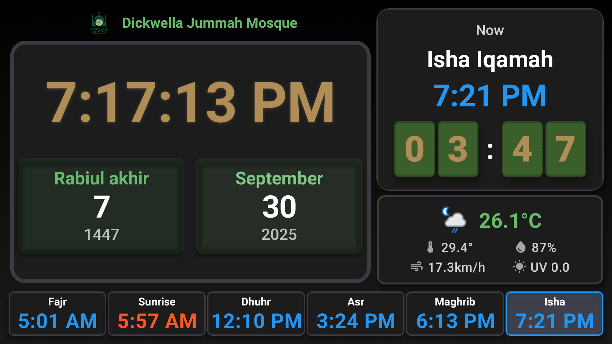
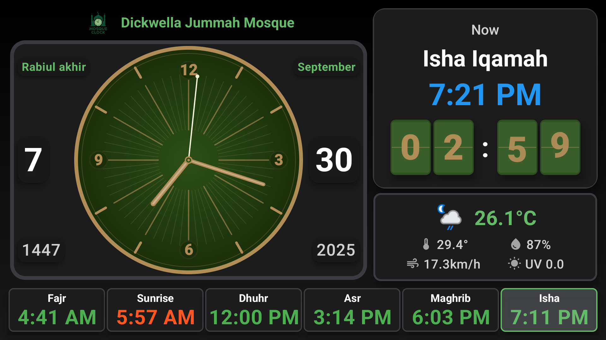
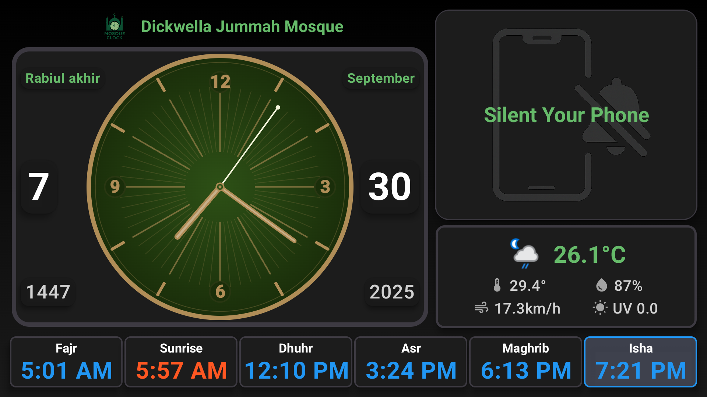
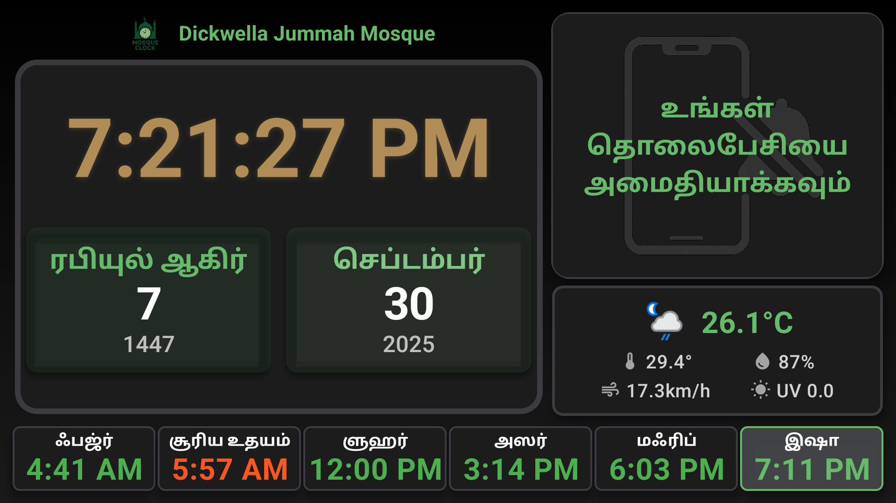
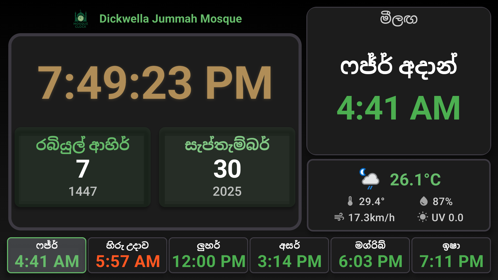

# Mosque Prayer Clock for Sri Lanka - Android TV Application

A comprehensive Android TV application designed for mosques to display prayer times, digital/analog clocks, weather information, and provide multilingual support. The app features direct ACJU web scraping, multiple weather providers, intelligent caching systems, and performance optimizations for seamless operation.

## 📸 Screenshots

<p align="center">
  
  
</p>

<p align="center">
  
  
</p>

<p align="center">
  
</p>

## 🌟 Features

### 🕌 Prayer Times Display
- **Multiple Prayer Time Sources**: 
  - **Direct ACJU Scraping**: Real-time web scraping from ACJU.lk with PDF parsing
  - **MosqueClock Backend API**: Custom backend with 13 Sri Lankan zones
  - **PrayerTimes.co.uk API**: UK-based international prayer times service
  - **Manual Entry**: Custom prayer times with configurable Iqamah gaps
- **Web Scraping Technology**:
  - **PDF Parser**: iTextPDF integration for extracting prayer times from PDF documents
  - **Jsoup HTML Parser**: Automated web scraping from ACJU website
  - **Apartment Adjustments**: Automatic time adjustments for apartment dwellers
  - **Offline Caching**: Stores scraped data for offline access
- **Five Daily Prayers**: Fajr, Dhuhr, Asr, Maghrib, Isha with Sunrise
- **Azan & Iqamah Times**: Synchronized animated display for all prayers
- **Next Prayer Highlight**: Automatically highlights upcoming prayer with countdown
- **Smart Caching**: Intelligent prayer times caching with provider-specific storage
- **13 Sri Lankan Zones**: Complete coverage of all prayer time zones in Sri Lanka

### 🕐 Clock Features
- **Digital Clock**: Large, customizable digital time display
- **Analog Clock**: Beautiful analog clock with traditional design
- **Both Clocks**: Display both digital and analog clocks simultaneously
- **Time Formats**: Support for 12-hour and 24-hour formats
- **Seconds Display**: Option to show/hide seconds
- **Hijri Date Display**: Islamic calendar with intelligent caching system

### 🌤️ Weather Integration
- **Multiple Weather Providers**:
  - **WeatherAPI.com**: Primary weather service with comprehensive data
  - **OpenWeatherMap**: Secondary provider for redundancy
  - **MosqueClock Backend Weather**: Custom weather aggregation service
- **Real-time Weather Data**: 
  - Temperature (Celsius/Fahrenheit)
  - Weather conditions with icons
  - Humidity levels
  - UV index
  - Wind speed
  - Visibility
  - Feels-like temperature
- **Location-based**: 
  - City name search
  - GPS coordinates support
  - Accurate weather for Sri Lankan cities
  - International city support
- **Smart Fallback**: Automatic provider switching if primary fails
- **Weather Icons**: Dynamic weather condition icons from provider APIs
- **Offline Support**: Caches last known weather data

### 🌍 Multilingual Support
- **English**: Full English language support
- **Tamil**: Complete Tamil language support (தமிழ்)
- **Sinhala**: Sinhala language support
- **Multi-Language**: Combined language display option
- **Dynamic Language Switching**: Change language in real-time

### ⚙️ Customization Options
- **Mosque Name**: Add custom mosque name display
- **Location Settings**: Configure region, city, and zones
- **Theme Selection**: Multiple themes including Default, Dark, Light, Mosque Green, Blue
- **Font Sizes**: Adjustable font sizes (Small, Medium, Large, Extra Large)
- **Clock Preferences**: Customize clock display options
- **Sound Notifications**: Prayer countdown ticking with 5-second alerts

### 📱 Android TV Optimized
- **TV Interface**: Designed specifically for Android TV and large screens
- **Remote Control Support**: Full D-pad and remote control navigation
- **Leanback Support**: Android TV Leanback launcher integration
- **Landscape Orientation**: Optimized for TV landscape display
- **Always-On Display**: Configurable screen-on settings for mosque displays

## 🏗️ Technical Architecture

### Built With
- **Kotlin**: Modern Android development language
- **Jetpack Compose**: Modern UI toolkit for native Android
- **Android TV**: Optimized for TV devices with Leanback support
- **Hilt**: Dependency injection framework
- **Room Database**: Local data persistence with intelligent caching
- **DataStore**: Settings and preferences storage
- **Retrofit**: REST API communication with multiple endpoints
- **Coroutines**: Asynchronous programming with performance optimizations
- **Material Design 3**: Modern UI components
- **iTextPDF**: PDF parsing for ACJU prayer time extraction
- **Jsoup**: HTML parsing and web scraping
- **Coil**: Image loading for weather icons
- **Kotlinx DateTime**: Cross-platform date/time handling
- **Gson**: JSON serialization/deserialization

### Architecture Pattern
- **MVVM**: Model-View-ViewModel architecture
- **Repository Pattern**: Data layer abstraction with smart caching
- **Clean Architecture**: Separation of concerns
- **Dependency Injection**: Hilt for dependency management

### 🚀 Performance Optimizations

#### Intelligent Caching System
- **Prayer Times Caching**: Provider-specific caching (MANUAL, ACJU_SCRAPING, PRAYERTIMES_UK, MOSQUE_CLOCK_API)
- **Web Scraping Cache**: Stores scraped PDF data to minimize repeated downloads
- **Hijri Date Caching**: Smart database caching with calculation fallbacks
- **Repository-level Cache**: In-memory caching for instant access
- **Weather Caching**: Caches weather data to reduce API calls
- **Auto-cleanup**: Removes old data after 30 days

#### Smart API Management
- **Throttling Removal**: Eliminated blocking throttling for responsive settings changes
- **Concurrent Protection**: Prevents duplicate API calls while allowing legitimate updates
- **Provider Isolation**: Separate caching per prayer time provider
- **Fallback Strategies**: Graceful degradation when APIs are unavailable
- **PDF Download Optimization**: Downloads prayer time PDFs only when needed
- **Network Retry Logic**: Automatic retry with exponential backoff

#### Database Optimizations
- **Composite Keys**: Provider-specific database IDs for accurate caching
- **Hijri Date Intelligence**: Calculates dates from cache when safe (non-month-end)
- **Background Threading**: All database operations on IO dispatcher
- **Smart Queries**: Efficient database lookups with provider context
- **Scraped Data Storage**: Efficient storage of PDF-extracted prayer times

#### Release Build Optimizations
- **ProGuard/R8 Minification**: Code obfuscation and optimization enabled
- **Resource Shrinking**: Removes unused resources automatically
- **APK Size**: ~10MB (optimized from ~15-20MB)
- **Debug Log Removal**: All debug logs stripped in production
- **Generic Type Preservation**: Properly configured for Retrofit APIs

## 📦 Installation & Setup

### Prerequisites
- Android Studio Arctic Fox or later
- Android SDK API 21 or higher (Android 5.0+)
- Target SDK: API 34 (Android 14)
- Android TV device or emulator
- Java 8 or higher
- Gradle 8.0+

### Quick Start
```bash
# Clone the repository
git clone <repository-url>
cd MosqueClock

# Create local.properties file
cp local.properties.example local.properties

# Add your API keys to local.properties
weather_api_key="your-weatherapi-key"
openweathermap_api_key="your-openweathermap-key"
mosque_clock_api_url="your-backend-url"

# Build debug APK
./gradlew assembleDebug

# Or build optimized release APK
./gradlew assembleRelease

# Install on connected device
adb install app/build/outputs/apk/debug/app-debug.apk
```

### Build Instructions

1. **Clone the Repository**
   ```bash
   git clone <repository-url>
   cd MosqueClock
   ```

2. **Configure API Keys**
   ```bash
   # Create local.properties file
   cp local.properties.example local.properties
   # Add your API keys:
   # WEATHER_API_KEY=your_openweather_api_key
   # MOSQUE_CLOCK_API_KEY=your_mosque_clock_api_key
   ```

3. **Build the Project**
   ```bash
   ./gradlew build
   ```

4. **Install on Android TV**
   ```bash
   ./gradlew installDebug
   ```

### 📱 Android TV Device Setup & Optimization

For optimal mosque display setup, use these ADB commands to configure your Android TV device:

#### Prerequisites
- Enable Developer Options and USB Debugging on Android TV
- Connect device via ADB: `adb connect <device_ip>:5555`
- Verify connection: `adb devices`

#### 🔐 Essential Permissions

**Grant Overlay Permission (Required for Always-On Display)**
```bash
# Grant system alert window permission
adb shell pm grant com.mosque.prayerclock android.permission.SYSTEM_ALERT_WINDOW

# Alternative method if above fails
adb shell appops set com.mosque.prayerclock SYSTEM_ALERT_WINDOW allow

# Verify overlay permission
adb shell appops get com.mosque.prayerclock SYSTEM_ALERT_WINDOW
```

**Grant Additional Permissions**
```bash
# Wake lock permission (keep screen on)
adb shell pm grant com.mosque.prayerclock android.permission.WAKE_LOCK

# Network access
adb shell pm grant com.mosque.prayerclock android.permission.INTERNET
adb shell pm grant com.mosque.prayerclock android.permission.ACCESS_NETWORK_STATE

# Location for weather (optional)
adb shell pm grant com.mosque.prayerclock android.permission.ACCESS_COARSE_LOCATION
```

#### 🔋 Battery Optimization Removal

**Disable Battery Optimization (Critical for 24/7 Operation)**
```bash
# Remove from battery optimization whitelist
adb shell dumpsys deviceidle whitelist +com.mosque.prayerclock

# Alternative method
adb shell cmd appops set com.mosque.prayerclock RUN_IN_BACKGROUND allow

# Disable doze mode for the app
adb shell dumpsys deviceidle whitelist +com.mosque.prayerclock

# Verify battery optimization status
adb shell dumpsys battery | grep -i mosque
```

**Disable Power Management Features**
```bash
# Disable adaptive battery
adb shell settings put global adaptive_battery_management_enabled 0

# Disable app standby
adb shell dumpsys usagestats set-standby-bucket com.mosque.prayerclock 10

# Keep app active
adb shell am set-inactive com.mosque.prayerclock false
```

#### 🏠 Launcher Configuration

**Set as Default Launcher (Kiosk Mode)**
```bash
# Clear current default launcher
adb shell pm clear-default-launcher

# Set MosqueClock as default launcher
adb shell cmd package set-home-activity com.mosque.prayerclock/.MainActivity

# Alternative method - disable current launcher first
adb shell pm disable-user --user 0 com.google.android.tvlauncher

# Enable MosqueClock as launcher
adb shell pm enable com.mosque.prayerclock
adb shell pm set-home-activity com.mosque.prayerclock/.MainActivity
```

**Launcher Management**
```bash
# List all launchers
adb shell pm query-activities --brief -c android.intent.category.HOME

# Reset to original launcher (if needed)
adb shell pm enable com.google.android.tvlauncher
adb shell cmd package set-home-activity com.google.android.tvlauncher/.TvLauncherActivity

# Clear launcher preferences (user will be prompted to choose)
adb shell pm clear-default-launcher
```

#### 🧹 Debloating & System Optimization

**Remove Unnecessary Apps (Android TV)**
```bash
# Google Apps (keep essential ones)
adb shell pm uninstall --user 0 com.google.android.youtube.tv
adb shell pm uninstall --user 0 com.google.android.apps.tv.launcherx
adb shell pm uninstall --user 0 com.google.android.katniss
adb shell pm uninstall --user 0 com.google.android.backdrop

# Netflix and streaming apps
adb shell pm uninstall --user 0 com.netflix.ninja
adb shell pm uninstall --user 0 com.amazon.avod.thirdpartyclient
adb shell pm uninstall --user 0 com.disney.disneyplus

# Gaming and entertainment
adb shell pm uninstall --user 0 com.google.android.play.games
adb shell pm uninstall --user 0 com.android.vending

# Social and communication
adb shell pm uninstall --user 0 com.google.android.apps.photos
adb shell pm uninstall --user 0 com.google.android.music
```

**Disable System Apps (Safer Alternative)**
```bash
# Disable instead of uninstall (can be re-enabled)
adb shell pm disable-user --user 0 com.google.android.youtube.tv
adb shell pm disable-user --user 0 com.netflix.ninja
adb shell pm disable-user --user 0 com.google.android.play.games

# List disabled packages
adb shell pm list packages -d

# Re-enable if needed
adb shell pm enable com.google.android.youtube.tv
```

#### ⚙️ System Settings Optimization

**Display Settings**
```bash
# Keep screen always on
adb shell settings put system screen_off_timeout 2147483647

# Set brightness to maximum
adb shell settings put system screen_brightness 255

# Disable screen saver
adb shell settings put secure screensaver_enabled 0

# Disable sleep mode
adb shell settings put global stay_on_while_plugged_in 7
```

**Network & Performance**
```bash
# Disable automatic updates
adb shell settings put global auto_update_enabled 0

# Disable usage stats
adb shell settings put global usage_stats_enabled 0

# Optimize for performance
adb shell settings put global animator_duration_scale 0.5
adb shell settings put global transition_animation_scale 0.5
adb shell settings put global window_animation_scale 0.5
```

**Privacy & Security**
```bash
# Disable location services (if not using weather)
adb shell settings put secure location_providers_allowed ""

# Disable crash reporting
adb shell settings put secure send_action_app_error 0

# Disable usage access
adb shell settings put secure usage_access_enabled 0
```

#### 🔄 Auto-Start Configuration

**Ensure App Starts on Boot**
```bash
# Enable auto-start permission
adb shell pm grant com.mosque.prayerclock android.permission.RECEIVE_BOOT_COMPLETED

# Set as persistent app
adb shell cmd appops set com.mosque.prayerclock RUN_ANY_IN_BACKGROUND allow

# Add to auto-start whitelist
adb shell dumpsys deviceidle whitelist +com.mosque.prayerclock
```

#### 📊 Verification Commands

**Check App Status**
```bash
# Verify app is installed and enabled
adb shell pm list packages | grep mosque

# Check app permissions
adb shell dumpsys package com.mosque.prayerclock | grep permission

# Check if app is running
adb shell ps | grep mosque

# Check battery optimization status
adb shell dumpsys deviceidle | grep mosque
```

**System Status**
```bash
# Check current launcher
adb shell cmd package get-home-activities

# Check screen timeout
adb shell settings get system screen_off_timeout

# Check disabled packages
adb shell pm list packages -d | grep -E "(youtube|netflix|play)"
```

#### 🚨 Troubleshooting

**Common Issues & Solutions**
```bash
# If overlay permission fails
adb shell settings put global policy_control immersive.full=com.mosque.prayerclock

# If app doesn't start on boot
adb shell am broadcast -a android.intent.action.BOOT_COMPLETED

# Reset all settings (if needed)
adb shell pm clear com.mosque.prayerclock

# Force stop and restart
adb shell am force-stop com.mosque.prayerclock
adb shell am start -n com.mosque.prayerclock/.MainActivity
```

**Factory Reset Preparation**
```bash
# Backup current configuration
adb shell pm list packages > installed_packages.txt
adb shell settings list system > system_settings.txt
adb shell settings list global > global_settings.txt

# Create setup script for quick reconfiguration
echo "#!/bin/bash" > setup_mosque_tv.sh
echo "adb shell pm grant com.mosque.prayerclock android.permission.SYSTEM_ALERT_WINDOW" >> setup_mosque_tv.sh
# Add other essential commands...
chmod +x setup_mosque_tv.sh
```

#### 🚀 Quick Setup Script


**Usage:**
```bash
# Run setup
./mosque_tv_setup.sh
```

### Backend Setup (Optional - Not needed since we are using ACJU direct scraping)

The app includes a custom FastAPI backend for enhanced features:

1. **Start Backend Services**
   ```bash
   cd backend
   docker run -d -p 27017:27017 --name mongodb-prayer-times mongo:latest
   uv sync
   uv run uvicorn app.main:app --reload --host 0.0.0.0 --port 8000
   ```

2. **Backend Features**
   - Prayer times for 13 Sri Lankan zones
   - Hijri calendar conversion
   - Weather data integration
   - Automatic ACJU data scraping

## ⚙️ Configuration

### Prayer Time Sources

#### 1. MosqueClock API (Recommended)
- **Zones**: 13 Sri Lankan zones with ACJU data
- **Features**: Automatic scraping, MongoDB caching, apartment adjustments
- **Endpoint**: `http://localhost:8000/api/v1/`

#### 2. Al-Adhan API
- **Coverage**: International prayer times
- **Regions**: Colombo, Kandy, Galle, Jaffna, and more
- **Features**: Hijri date integration, multiple calculation methods

#### 3. Manual Entry
- **Custom Times**: Set prayer times manually
- **Iqamah Gaps**: Configurable gaps between Azan and Iqamah
- **Flexibility**: Perfect for mosques with specific timing requirements

### Weather Configuration
- **OpenWeatherMap**: Requires API key in `local.properties`
- **MosqueClock Weather**: Uses custom backend weather service
- **City Coordinates**: Automatic mapping for Sri Lankan cities

### Default Settings
- **Prayer Service**: Manual (can be changed to API sources)
- **Language**: English
- **Location**: Configurable based on selected service
- **Clock Type**: Digital
- **Theme**: Default (system-based)
- **Weather**: Disabled by default

## 🎮 Usage

### Navigation
- **Menu Button**: Access settings screen
- **Back Button**: Return to main screen from settings
- **D-pad**: Navigate through settings options
- **Remote Control**: Full Android TV remote support

### Main Screen
- **Prayer Times**: Animated cards showing Azan ⟷ Iqamah times
- **Current Time**: Large digital/analog clock display
- **Hijri Date**: Islamic calendar with intelligent caching
- **Weather Info**: Temperature, conditions, and details (when enabled)
- **Next Prayer**: Highlighted with countdown

### Settings Screen
- **Prayer Service**: Choose between MosqueClock API, Al-Adhan API, or Manual
- **Location**: Configure zones (MosqueClock) or regions (Al-Adhan)
- **Manual Times**: Set custom prayer and Iqamah times
- **Weather**: Enable/disable weather with provider selection
- **Hijri Provider**: Choose Hijri date source
- **Display**: Clock type, theme, font size, language
- **Sound**: Prayer countdown notifications

## 💾 Data Storage

### Local Database (Room)
- **Prayer Times**: Cached with provider-specific keys
- **Hijri Dates**: Intelligent caching with calculation fallbacks
- **Auto-cleanup**: Removes data older than 30 days
- **Provider Isolation**: Separate caching per API source

### Settings (DataStore)
- **User Preferences**: Language, theme, location settings
- **Clock Configuration**: Display preferences and customizations
- **Mosque Information**: Custom mosque name and details
- **API Configuration**: Selected providers and credentials

### Caching Strategy
- **Repository Cache**: In-memory for instant access
- **Database Cache**: Persistent storage with smart queries
- **Calculation Cache**: Hijri dates calculated from recent data
- **Provider Context**: Separate caches per prayer time source

## 🌐 API Integration

### MosqueClock Backend API
- **Prayer Times**: `/api/v1/prayer-times/{zone}/`
- **Today's Times**: `/api/v1/today/?zone={zone}`
- **Hijri Calendar**: `/api/v1/today-both-calendars/`
- **Weather**: `/api/v1/weather/current/city/{city}/`

### Al-Adhan API
- **Prayer Times**: `/v1/timingsByCity`
- **Hijri Integration**: Automatic Hijri date extraction
- **Multiple Regions**: Support for various Sri Lankan cities

### Offline Support
- **Smart Caching**: Works offline with cached data
- **Automatic Refresh**: Updates when network is available
- **Fallback Strategies**: Graceful degradation when APIs fail

## 🎨 Themes & Customization

### Available Themes
1. **Default**: System-based light/dark theme
2. **Light**: Light theme with green accents
3. **Dark**: Dark theme with green accents
4. **Mosque Green**: Green-themed design
5. **Blue**: Blue-themed design

### Font Sizes
- **Small**: Compact display for smaller screens
- **Medium**: Standard size for most displays
- **Large**: Enhanced visibility for large screens
- **Extra Large**: Maximum visibility for distant viewing

## 🔧 Troubleshooting

### Common Issues

1. **Prayer Times Not Loading**
   - Check internet connection
   - Verify selected prayer service in settings
   - Try switching between API providers
   - Check API keys in `local.properties`

2. **Weather Not Displaying**
   - Ensure weather is enabled in settings
   - Verify OpenWeatherMap API key
   - Check city selection and coordinates

3. **Hijri Date Issues**
   - Try different Hijri providers in settings
   - Check if manual Hijri date needs updating
   - Verify API connectivity

4. **Performance Issues**
   - Clear app data to reset caches
   - Check for sufficient storage space
   - Restart the application

5. **Always-On Display Not Working**
   - Grant overlay permission using ADB commands (see Android TV Setup section)
   - Remove app from battery optimization
   - Check screen timeout settings

6. **App Not Starting on Boot**
   - Use ADB commands to whitelist the app
   - Grant RECEIVE_BOOT_COMPLETED permission
   - Set app as persistent (see Auto-Start Configuration)

7. **Kiosk Mode Issues**
   - Set app as default launcher using ADB
   - Disable other launchers if needed
   - Use the provided setup script for automation

### Debug Mode
- Enable detailed logging in `NetworkModule.kt`
- Check logcat for API response details
- Monitor caching behavior through debug logs

## 🤝 Contributing

1. Fork the repository
2. Create a feature branch (`git checkout -b feature/amazing-feature`)
3. Make your changes with proper testing
4. Commit your changes (`git commit -m 'Add amazing feature'`)
5. Push to the branch (`git push origin feature/amazing-feature`)
6. Open a Pull Request

### Development Guidelines
- Follow Kotlin coding standards
- Use Jetpack Compose for UI components
- Implement proper error handling
- Add appropriate logging
- Test on Android TV devices

## 📄 License

This project is licensed under the MIT License - see the LICENSE file for details.

## 🙏 Acknowledgments

- **ACJU (All Ceylon Jamiyyathul Ulama)** for prayer times data
- **Al-Adhan API** for international prayer times service
- **OpenWeatherMap** for weather data

## 📞 Support

For support and questions:
- **Issues**: Create an issue in the repository

---

**Note**: This application is designed specifically for mosque use and requires proper configuration of prayer time sources and location settings to display accurate information for your region.